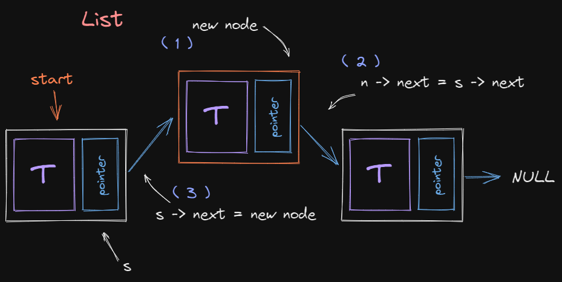
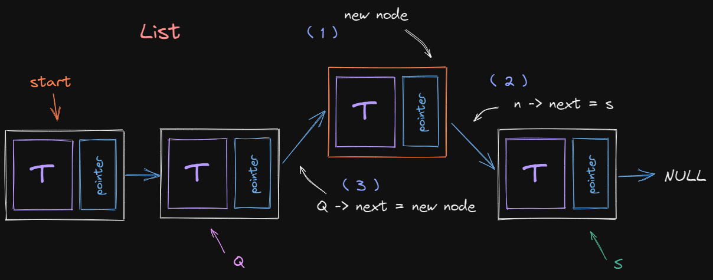
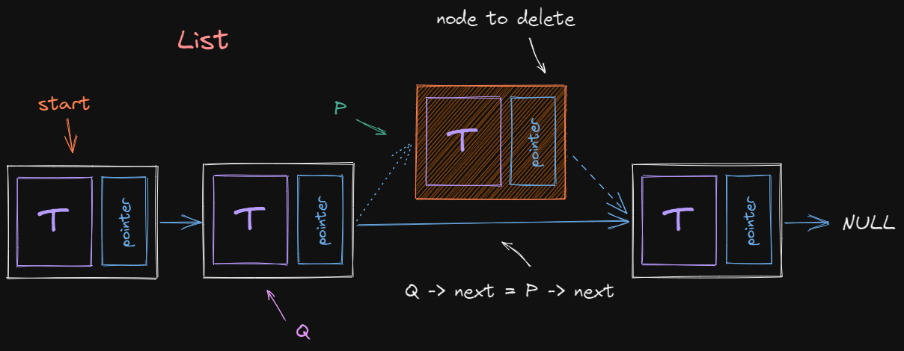
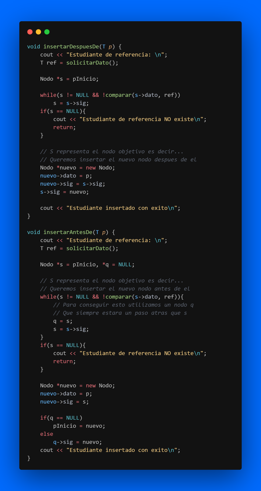
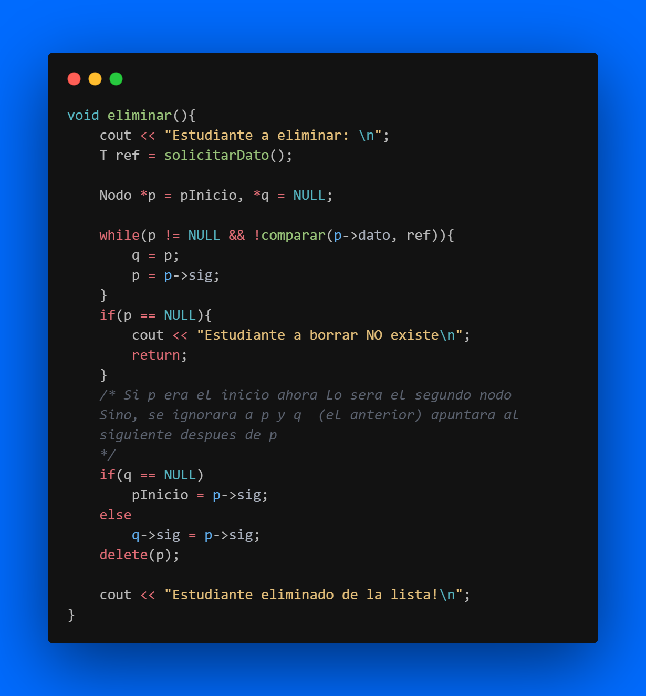

# Grupo 7
## Ejercicio:

Haciendo uso de listas: simple, circular o doblemente enlazada deberá crear el siguiente programa:

Se necesita un programa para llevar el control de la asistencia a los laboratorios de la materia PED. El programa debe ser capaz de colocar **estudiantes** en la lista y realizar las siguientes operaciones haciendo uso de un menú:

1. Insertar
    - Al principio o al final
    - Antes de o después de otro estudiante 
2. Mostrar todos los estudiantes
3. Eliminar un elemento de la lista

La estructura de los estudiantes debe contener: **nombre**, **carnet** y *Un campo adicional de su preferencia*

**Recordatorio:** está prohibido usar la librería: `#include <list>`

*Recomendación para estudiar: Después del lab traten de replicarlo usando una lista doblemente enlazada y muestren los datos de adelante hacia atrás y de atrás hacia adelante.*

### Ejemplo de estudiante:
```
Estudiante
Nombre: Carlos Mercado
Carnet: 00058820
Edad: 21
``` 

## Criterios de evaluación
1. Dominio de git 5%
2. Indentacion del código fuente 5%
3. Implementa correctamente una lista 25%
4. Uso correcto de punteros 25%
5. El programa se ejecuta sin errores 10%
6. Maneja el struct correctamente 15%
7. El programa muestra el resultado esperado 15%

## Puntos de los objetivos
El programa muestra el resultado esperado (15%) y
El programa se ejecuta sin errores (10%):
- Muestra el menú de opciones (1/10)
- Funciones de inserción de datos (2/10) c/u
- Función mostrar elementos completa (3/10)
- Función eliminar elemento completa (2/10)

### Insertar después de...



### Insertar antes de...



### Eliminar elemento



### Ejemplos



