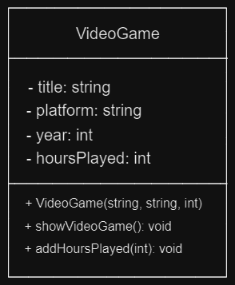

# Grupo 7
## Ejercicio:

Un cibercafé planea llevar un control de los juegos que más disfrutan sus clientes, por lo que te contratan a ti para hacer un programa que lleve control de las horas jugadas de cada juego que se ingrese al sistema.

Para realizar esto deberás hacer un programa que implemente programación orientada a objetos, además deberás almacenar todos los juegos que se ingresen al sistema en la estructura dinámica de tu preferencia y que consideres se acopla mejor a las necesidades del sistema.

### Diagrama UML a seguir


El programa debe tener las siguientes funciones:
1. Agregar nuevos juegos a la estructura dinámica.
2. Ver todos los juegos almacenados, así como su información (todos sus atributos).
3. Seleccionar un juego de los almacenados y agregarle x horas de juego
4. Recorrer todos los juegos almacenados y deberá agregarle una cantidad aleatoria de horas de juego a cada juego.

Notas:
- Al agregar los juegos deben tener 0 horas jugadas
- Es importante que no se sobre escriban las horas de juego, sino que agreguen a las que el juego ya tenga en ese momento.
- Respetar los especificadores de acceso que tiene el diagrama UML, además utilizar sus métodos para llevar a cabo las funciones solicitadas.
- Sube los cambios al repositorio y utiliza los comandos en el orden correcto (git add, git commit, git push)

## Criterios de evalucación
1. Dominio de git 5%
2. Uso correcto de constructores, variables publicas y privadas 25%
3. Uso correcto de objetos 25%
4. Uso correcto de métodos 10%
5. Uso correcto de clases 20%
6. El código compila sin errores 15%

## Sobre numeros aleatorios
```c++
#include <stdlib.h>     /* srand, rand */
#include <time.h>       /* time */

/* initialize random seed */
srand(time(NULL));

int random = rand() % 1000 + 1;
```

## C++ Access Specifiers
[Access Specifiers](https://www.w3schools.com/cpp/cpp_access_specifiers.asp)