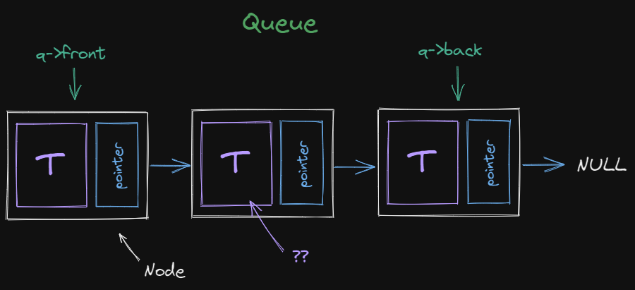

# Grupo 7
## Ejercicio:

Crear un sistema de gestión de colas para un taller, el cual necesita la información:  **modelo**, **color** y **kilometraje** de los autos al entrar en la cola. Debe crear un menú donde se pueda acceder a las siguientes funciones:

1. Agregar un automóvil nuevo
2. Mostrar la cola completa
3. Eliminar el primer automóvil de la cola, al momento de eliminarlo deberá cobrar un monto $xx.xx, cuya única restricción es que sea **proporcional** al kilometraje del automóvil.

*Pista: Entre más grande sea el kilometraje del carro deberá pagar más, un carro con kilometraje 0 pagara la tarifa base*

### Ejemplo de automóvil:

```
Auto
Modelo: Toyota Corolla
Color: Rojo
kilometraje: 5000
``` 

## Criterios de evalucación
1. Dominio de git 5%
2. Indentacion del codigo fuente 5%
3. Implementa correctamente una cola 25%
4. Uso correcto de punteros 25%
5. El programa se ejecuta sin errores 10%
6. Maneja el struct correctamente 15%
7. El programa muestra el resultado esperado 15%

## Puntos de los objetivos
El programa muestra el resultado esperado (15%) y
El programa se ejecuta sin errores (10%):
- Muestra el menú de opciones (1/10)
- Función 1 completa (3/10)
- Función 2 completa (4/10)
- Función 3 completa (2/10)

## Estructura de una cola

