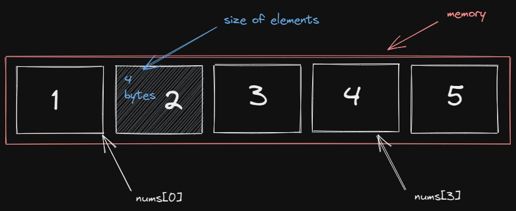
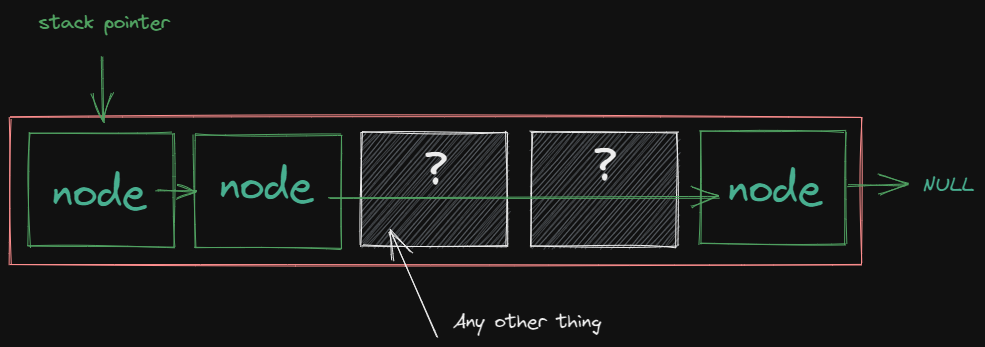
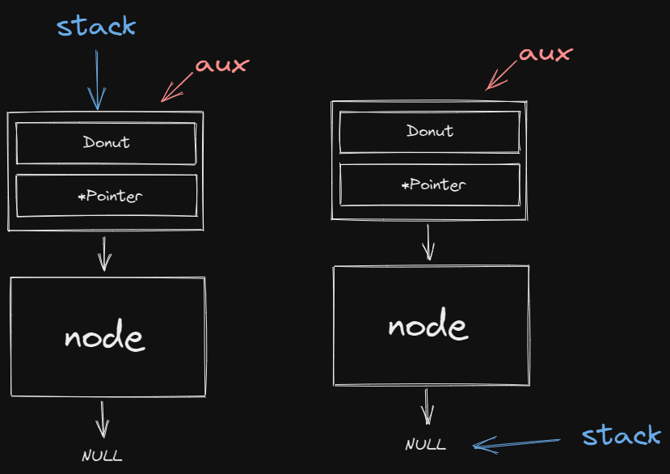

# Número de elementos dentro de una pila

### sizeof
1. Da el tamaño en bytes de la representación del objeto.
2. Da el tamaño en bytes de la representación del objeto del tipo de expresión, si se evalúa esa expresión.

Por ejemplo al obtener el número de elementos dentro de un array de 5 números enteros.

```
cout << sizeof(int); // Output: 4
```

`sizeof(int)`: Nos devuelve en numero de bytes usados para almacenar un entero.

```
int nums[] = {1, 2, 3, 4, 5};
cout << sizeof(nums); // Output: 20
```

`sizeof(nums)`: Nos devuelve el número de bytes utilizados para almacenar el array de números enteros.

Por lo tanto, si queremos conocer el número de elementos, debemos dividir el total de espacio reservado entre el espacio de cada elemento.

```
int nums[] = {1, 2, 3, 4, 5};
cout << sizeof(nums) / sizeof(int); // Output: 5
```

Esto es posible porque al crear un array implícita o explícitamente estamos definiendo el total de espacio que usara en la memoria, además dichos espacios de memoria están juntos uno después de otro.



Que es por lo cual nosotros podemos acceder a un array sumando direcciones de memoria al inicio del array `nums[i]` donde i puede tomar cualquier índice de posiciones valido en este caso de entre [0,4].

## ¿Como hacer esto en una pila?
Si tenemos el ejemplo:

```
struct nodo{
    Pizza elemento;
    struct nodo *siguiente;
};
typedef struct nodo *Stack;

int main()
{
    Stack pizza_stack;
    initialize(&pizza_stack);
    
    cout << sizeof(pizza_stack); // Output: 8
    cout << sizeof(*pizza_stack); // Output: 48
    
    return 0;
}
```
No podemos usar `sizeof(pizza_stack)` ni `sizeof(*pizza_stack)` ya que son la cantidad de bytes usados para almacenar la dirección de memoria (puntero) y el objeto de tipo `nodo` respectivamente, recordemos que una pila se almacena en memoria de manera dinámica por lo que los "bloques" dentro de la memoria no estarán juntos.



Por lo que recorrer los nodos se vuelve un poco más complicado, ya que no existe continuidad se utilizan punteros entre nodos para mantener la correlación entre estos y que no queden perdidos o errantes en la memoria.

La libreria `<stack>` tiene una función que recorre la pila desde su elemento superior o cima hasta el fin o NULL, contando el número de elementos de la misma.

Nosotros podemos replicar este comportamiento haciendo uso de los saltos (relaciones) que existen entre los nodos, esto por medio de punteros.

Ejemplo:

```
void size(Stack *s) {
    if(empty(s)) {
        cout << "Numero de elementos: 0";
        return;
    }
    
    Stack aux = *s;
    int count = 0;
    do 
    {
        count++;
        *s = (*s)->siguiente;
    }
    while (*s != NULL);

    *s = aux;
    
    cout << "Numero de elementos: " << count;
}
```

En este código creamos una "pila" auxiliar que mire al primer nodo de la pila original, posteriormente recorremos la pila original dando saltos hasta que esta es NULL es decir el final de la pila. Pero contamos los saltos realizados.

Este comportamiento se podria representar graficamente asi:



Nota: Tambien pudimos haber recorrido la stack auxiliar.

Además, esto también se puede hacer vaciado la pila original mientras llenamos una auxiliar haciendo uso de las funciones `EMPTY, TOP, POP`, contamos cada iteración realizada y posteriormente devolvemos los elementos a la pila original. Esta permanecerá intacta a pesar de haber sido vaciada temporalmente.

