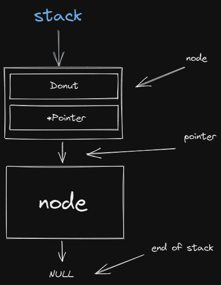
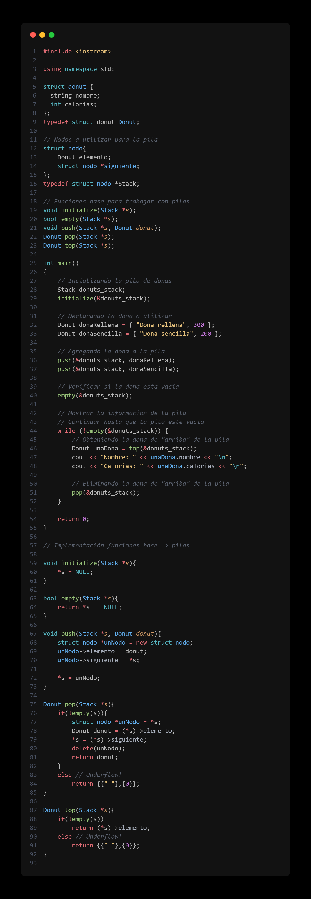

# Grupo 7
## Ejercicio:

Realice un programa en el que se puedan almacenar (utilizando pilas) los registros de las cajas de pizza que son ordenadas en un restaurante, cada registro debe de incluir: nombre de la pizza, precio y porciones.

## Objetivos
- Implementar correctamente las pilas.
- Agregar dos o más pizzas a la pila (pueden agregarlas desde el código).
- El programa deberá mostrar un menú de opciones entre las que están:
    1. mostrar la información de las pizzas almacenadas (Se puede destruir la pila).
    2. Deberán incluir una función que muestre el número de elementos en la pila sin destruir el contenido de la pila antes de llamar a la función. Es decir, se deberá poder llamar a la función 2 y posteriormente a la 1 y esta última aun podrá mostrar la información de la pila.

### Ejemplo:

```
Pizza
Nombre: Pizza de jamón
Precio: 19.99
Porciones: 12
``` 

## Criterios de evalucación
1. Dominio de git 5%
2. Indentacion del codigo fuente 5%
3. Implementa correctamente una pila 25%
4. Uso correcto de punteros 25%
5. El programa se ejecuta sin errores 10%
6. Maneja el struct correctamente 15%
7. El programa muestra el resultado esperado 15%

# Puntos de los objetivos
El programa muestra el resultado esperado (15%) y
El programa se ejecuta sin errores (10%):
- Muestra el menú de opciones (1/10)
- Objetivo 1 completo (4/10)
- Objetivo 2 completo (5/10)

## Estructura de una pila



## Muestra de Implementación de pilas


