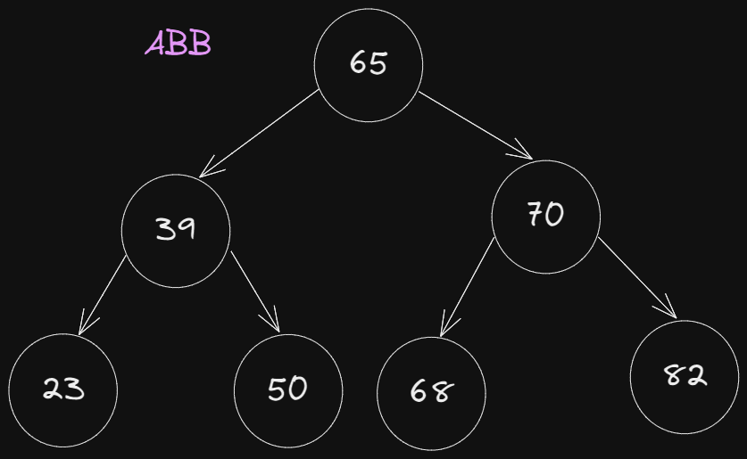
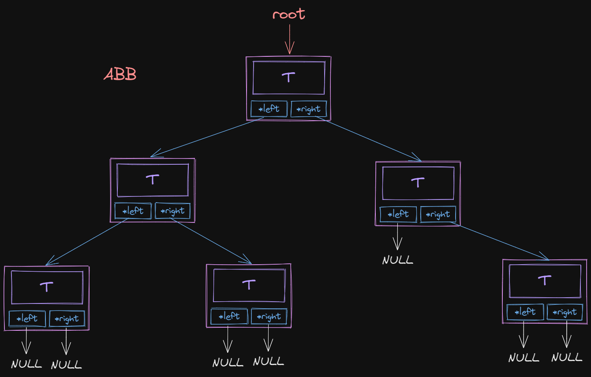
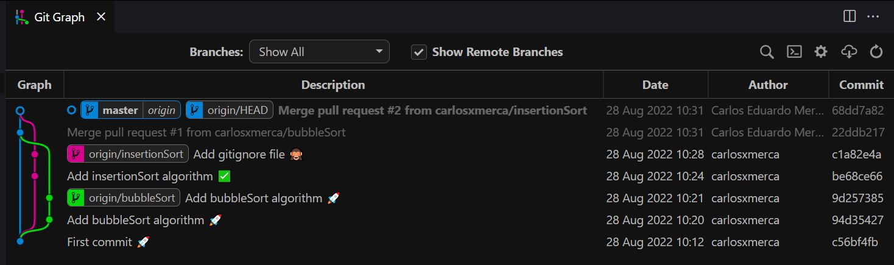

## Grupo 7
Hacer grupos de 2 o 3 personas

Crear un programa de Árbol Binario de Búsqueda con datos enteros, los datos del árbol se deberán ingresar a partir de un arreglo ya sea ingresando datos por el usuario o quemado.
 
Deberá crear una función para mostrar el subárbol izquierdo o derecho (o ambos si desean) en los 3 recorridos (*InOrder*, *PreOrder* y *PostOrder*).

Deberá crear una función que devuelva el *menor* dato que se encuentra en el árbol y una función que devuelva el dato *mayor*.

Adicionalmente junto con su código tienen que publicar una captura de pantalla de *Git Graph* donde se muestre el flujo de trabajo que llevo el equipo.

## ABB de prueba
```
{65, 39, 70, 23, 50, 68, 82}
```

## Metodología

1. Dividir las funciones a realizar de manera equitativa entre los miembros del grupo.

2. Tras clonar el repositorio un estudiante estará encargado de crear el archivo principal del programa `main.cpp` en este momento solo deberá contener un comentario con el nombre de su grupo y la estructura base propuesta.

3. Adicionalmente deberá de crear un archivo `README.md` que tendrá la siguiente información.
    - Nombre de equipo
    - Integrantes de equipo
    - Funciones que realizara cada integrante del equipo.

4. Cuando estos archivos ya estén en Github los demás integrantes del equipo deberán de clonar el repositorio y crear una rama con su **nickname** (En este momento ya tendrán los archivos que se crearon en los pasos 2 y 3).

5. Trabajar en la implementación de las funciones a realizar.

6. Cada integrante deberá publicar su trabajo finalizado **en su rama**.

7. Trabajando en conjunto deberán hacer un **merge** del trabajo hecho en las ramas secundarias a la rama principal, (si existiera algún conflicto de merge este debe ser resuelto y se debe realizar un nuevo commit).

8. Todos los miembros del equipo deberán hacer **pull** de los cambios realizados en la rama principal y deberán revisar que todo funcione de manera óptima.

9. Si existiera alguna modificación adicional esta se puede realizar sobre la rama principal.

## Enlaces utiles
- [Markdown guide](https://www.markdownguide.org/basic-syntax/)
- [Git and Github guide](https://github.com/carlosxmerca/PED2022/blob/master/Github/Guia%20github.pdf)
- [Binary search video](https://www.youtube.com/watch?v=MFhxShGxHWc)

## Criterios de evaluación
1. Dominio de git 5%
2. Indentacion del código fuente 5%
3. Implementa correctamente un ABB 25%
4. Uso correcto de punteros 25%
5. El programa se ejecuta sin errores 10%
6. Maneja el struct correctamente 15%
7. El programa muestra el resultado esperado 15%

## Puntos de los objetivos
El programa muestra el resultado esperado (15%) y
El programa se ejecuta sin errores (10%):

- Muestra el menú de opciones (1/10)
- Funciones de inserción de datos (1/10) 
- Función muestra sub arbol (2/10) c/u
- Función devuelve el menor dato (1/10)
- Función devuelve el mayor dato (1/10)

## Ejemplo de ABB


## Estructura de un ABB


### Muestra de Git graph


## Estructura de main.cpp

```c++
/* Recordatorio no están obligados a usar estos structs ni nada de este archivo es
una recomendación para que trabajen de manera ordenada. */
// Grupo: 

#include <iostream>
using namespace std;

//------ Structs de nodo y de arbol ------
typedef int T;

struct Nodo{
    T info;
    struct Nodo *izq;
    struct Nodo *der;
};
typedef struct Nodo *Arbol;

Arbol crearArbol(T x);

//------ Declaración de funciones Integrante #1 ------

//------ Declaración de funciones Integrante #2 ------

//------ Declaración de funciones Integrante #3 ------

int main(){
    cout << "Creando ABB...\nValor de la raiz: ";
    Arbol arbol = crearArbol(solicitarDato());
    
    return 0;
}

//------ Implementación de funciones Integrante #1 ------

//------ Implementación de funciones Integrante #2 ------

//------ Implementación de funciones Integrante #3 ------
```

## Estructura de readme

```md
## Grupo: HakunaMatata

#### Integrantes
1. Carlos Merca 00058820
2. Leonel Messi 10
3. Cristiano Ronaldo 7

#### Funciones por integrante
- Carlos Merca
    - Estructura base 
    - Insertar datos

- Leonel Messi
    - Mostrar el subárbol izquierdo o derecho

- Cristiano Ronaldo
    - Función que devuelva el *menor* dato que se encuentra en el árbol
    - Función que devuelva el dato *mayor*
```